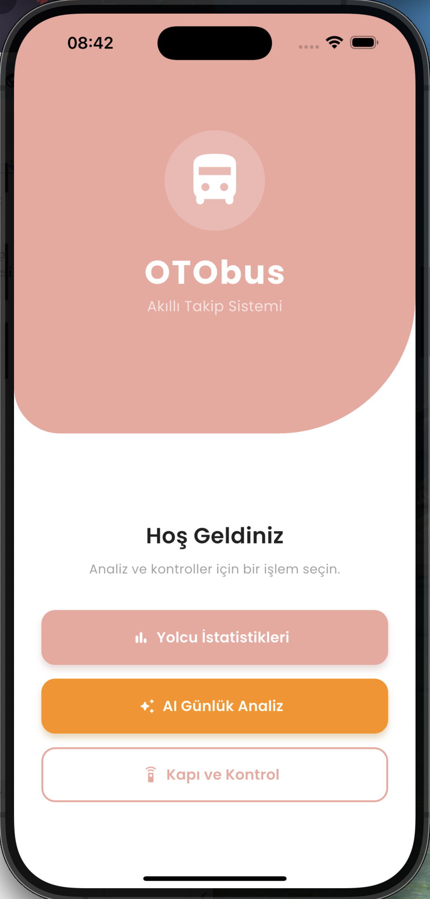
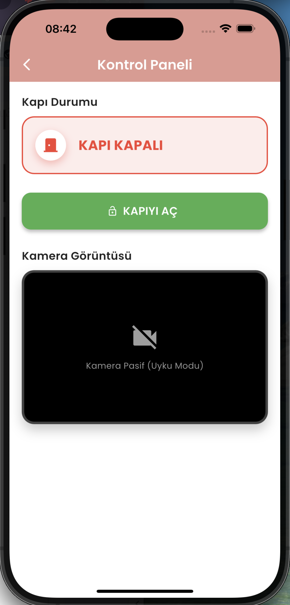
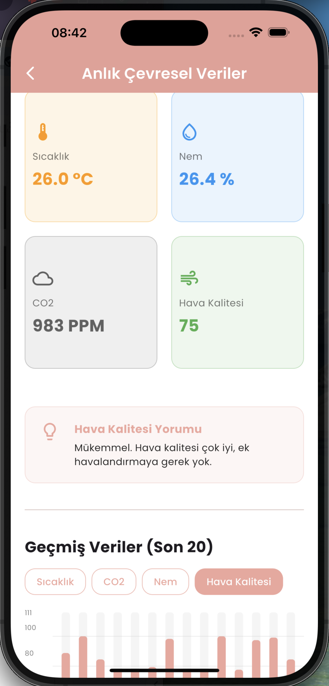

# 🚍 OTObus - Smart Transportation Tracking System
>An IoT-based smart public transportation system that tracks real-time passenger count, environmental conditions, and provides AI-powered analytics.


---
## 📋 Table of Contents
- [Overview](#-overview)
- [System Architecture](#-system-architecture)
- [Counting Logic](#-counting-logic)
- [Database Structure](#-database-structure)
- [Technologies Used](#-technologies-used)
- [Screenshots](#-screenshots)
- [Project Structure](#-project-structure)
- [Setup Guide](#-setup-guide)
- [Known Limitations](#-known-limitations)
- [Security Notes](#-security-notes)
---
## 🎯 Overview
OTObus is a comprehensive IoT solution designed to modernize public transportation by providing:
- **Real-time Passenger Counting**: Computer vision-based passenger detection using Raspberry Pi 3 Model A+
- **Environmental Monitoring**: Temperature, humidity, air quality (CO2/VOC) sensors via NodeMCU ESP8266
- **Mobile Dashboard**: Flutter app for monitoring and control
- **AI Analytics**: Daily reports with weather and holiday correlation
---
## 🏗 System Architecture
```
┌─────────────────┐     ┌──────────────────┐     ┌─────────────────┐
│  Raspberry Pi   │────▶│     Firebase     │◀────│    NodeMCU      │
│ 3 Model A+      │     │ Realtime Database│     │    ESP8266      │
│ (CV Counting)   │     └────────┬─────────┘     │   (Sensors)     │
└─────────────────┘              │               └─────────────────┘
                    ┌────────────┴────────────┐
                    ▼                         ▼
            ┌──────────────┐          ┌──────────────┐
            │ Flutter App  │          │  AI Server   │
            │   (Mobile)   │          │  (FastAPI)   │
            └──────────────┘          └──────────────┘
```


---
## 🚪 Counting Logic
To optimize performance and reduce processing load on Raspberry Pi 3 Model A+, we implemented a **door-triggered counting system**:
1. **Sleep Mode**: Camera stays in sleep mode while the door is closed
2. **Active Mode**: When the door opens, the camera wakes up and starts detecting passengers
3. **Tracking**: System tracks people crossing a virtual line (entering/exiting)
4. **Calculation**: When door closes:
   ```
   new_total = current_total + (entered - exited)
   ```
5. **Logging**: Result is logged to Firebase with timestamp
This approach prevents overheating and focuses detection on the door area where passengers are more distinguishable.
---
## 🗄 Database Structure
```
Firebase Realtime Database
│
├── home/
│   ├── current_data/          # Real-time sensor readings (widgets display)
│   │   ├── temperature
│   │   ├── humidity
│   │   ├── co2
│   │   ├── voc_quality
│   │   ├── readable_time
│   │   └── time_stamp
│   │
│   ├── environment_history/   # Historical sensor logs (append-only)
│   │   └── log_YYYYMMDD_HHMMSS/
│   │
│   ├── door_status            # Boolean - door open/closed state
│   ├── entered                # Int - passengers entered (current session)
│   ├── exited                 # Int - passengers exited (current session)
│   └── passenger_count        # Int - total passengers on bus
│
└── logs/                      # Passenger count history (per door cycle)
    └── {push_id}/
        ├── date
        ├── time
        ├── timestamp
        ├── density
        └── occupancy
```
---
## 🛠 Technologies Used
### Mobile Application
| Technology | Purpose |
|------------|---------|
| **Flutter 3.10+** | Cross-platform mobile app development |
| **Firebase Realtime Database** | Real-time data synchronization |
| **FL Chart** | Interactive charts for statistics visualization |
| **Google Fonts (Poppins)** | Modern typography |
| **HTTP Package** | REST API communication with AI server |
| **Intl** | Date formatting and localization |
### AI Server
| Technology | Purpose |
|------------|---------|
| **Python 3.9+** | Backend programming language |
| **FastAPI** | High-performance REST API framework |
| **Pandas** | Data manipulation and analysis |
| **Meteostat** | Historical weather data retrieval for Sakarya region |
| **Uvicorn** | ASGI server for FastAPI |
### Hardware - Raspberry Pi 3 Model A+
| Technology | Purpose |
|------------|---------|
| **OpenCV** | Computer vision and image processing |
| **MobileNet SSD** | Pre-trained deep learning model for person detection |
| **Firebase Admin SDK** | Server-side Firebase operations |
| **Flask** | Video streaming server for live feed |
### Hardware - NodeMCU ESP8266
| Technology | Purpose |
|------------|---------|
| **Arduino IDE** | Microcontroller programming |
| **DHT22** | Temperature and humidity sensor |
| **MQ135** | Air quality (VOC) sensor |
| **MH-Z19** | CO2 concentration sensor |
| **MAX7219** | 7-segment LED display driver |
| **FirebaseESP8266** | Firebase client library |
---
## 📱 Screenshots
### Home Screen

---
### Control Screen
- Door control and live camera feed from Raspberry Pi.

---
### Statistics Screen
- Real-time passenger count with environmental data display.
- Historical data visualization with interactive charts.

---
### AI Analysis Screen
- AI-powered daily reports with weather and holiday insights.

---
### Raspberry Pi Output
- Computer vision passenger detection in action.

---
## 📁 Project Structure
```
OTObus_Smart-Transportation-Tracking-System/
├── mobile/
│   └── otobus_app/              # Flutter mobile application
│       ├── lib/
│       │   ├── screens/         # UI screens
│       │   ├── services/        # API services
│       │   ├── models/          # Data models
│       │   └── widgets/         # Reusable components
│       └── pubspec.yaml
│
├── ai-server/
│   └── otobus_ai_server/        # Python FastAPI server
│       ├── main.py              # API endpoints
│       └── holidays.json        # Turkish holidays (manual)
│
├── hardware/
│   ├── nodemcu/                 # ESP8266 sensor code
│   │   └── OTObus_Sensor.ino
│   │
│   └── raspberry-pi/            # Computer vision code
│       └── iot_project.py
│
├── media/
│   └── screenshots/             # App screenshots
│
└── docs/
    └── IoT-Rapor.pdf            # Project report (Turkish)
```
---
## 🚀 Setup Guide
### Prerequisites
- Flutter SDK 3.10+
- Python 3.9+
- Arduino IDE
- Firebase Project with Realtime Database
### 1. Mobile App Setup
```bash
cd mobile/otobus_app
flutter pub get
flutter run
```
### 2. AI Server Setup
```bash
cd ai-server/otobus_ai_server
python -m venv venv
source venv/bin/activate  # Windows: venv\Scripts\activate
pip install fastapi uvicorn pandas meteostat requests
python main.py
```
### 3. NodeMCU Setup
1. Create `config.h` file with your credentials:
   ```cpp
   #define WIFI_SSID "your_wifi_name"
   #define WIFI_PASSWORD "your_wifi_password"
   #define FIREBASE_HOST "https://your-project.firebaseio.com/"
   #define FIREBASE_AUTH "your_database_secret"
   ```
2. Upload to NodeMCU via Arduino IDE
### 4. Raspberry Pi Setup
1. Create `config.py` with your Firebase URL
2. Download `serviceAccountKey.json` from Firebase Console
3. Install dependencies:
   ```bash
   pip install opencv-python numpy firebase-admin flask
   ```
4. Download MobileNet SSD model files:
   - `MobileNetSSD_deploy.prototxt`
   - `MobileNetSSD_deploy.caffemodel`
5. Run:
   ```bash
   python iot_project.py
   ```
---
<a id="-known-limitations"></a>
## ⚠️ Known Limitations
> [!NOTE]
> **Hardware Constraints**: Due to limited resources, we used Raspberry Pi 3 Model A+, which has lower processing power. Using a higher-end model (e.g., Raspberry Pi 4 or 5) would significantly improve detection accuracy and response time.
> [!NOTE]
> **Simulated Data**: The passenger count data in the database was generated artificially using AI for simulation purposes, as real-world testing with actual passengers was not feasible.
> [!NOTE]
> **Manual Holiday Data**: Due to institutional network restrictions (KVKK compliance), we are unable to fetch holiday data from external APIs. Turkish holidays are manually configured in `ai-server/otobus_ai_server/holidays.json`.
---
## 🔒 Security Notes
> [!IMPORTANT]
> **Firebase API Keys**: The API keys in `firebase_options.dart` are restricted by Firebase Security Rules. They identify the project but do not grant unauthorized access.
> [!WARNING]
> **Never commit these files:**
> - `config.h` (NodeMCU credentials)
> - `config.py` (Raspberry Pi credentials)  
> - `serviceAccountKey.json` (Firebase Admin SDK)
These files are excluded via `.gitignore`.

---
## 👥 Contributors
- Sude Andurman
- Elif Sena Soysal
- Zehra Burcu
---
<p align="center">
  Made with ❤️ for Smart Transportation that also cares about people's health
</p>


